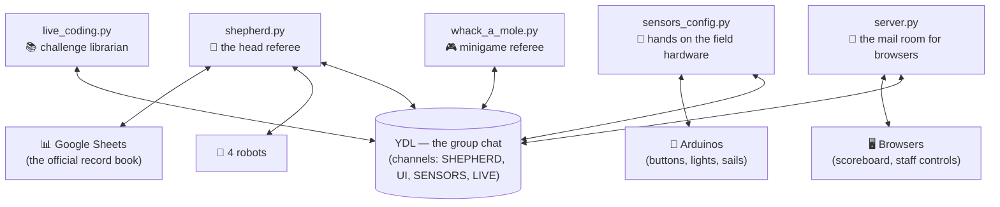
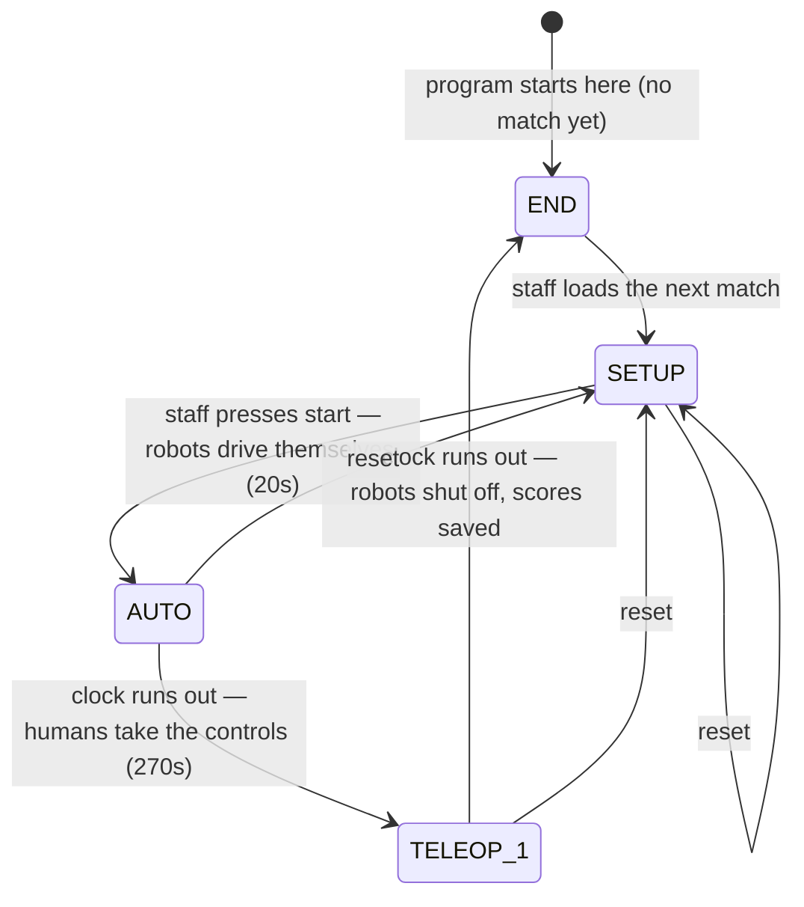
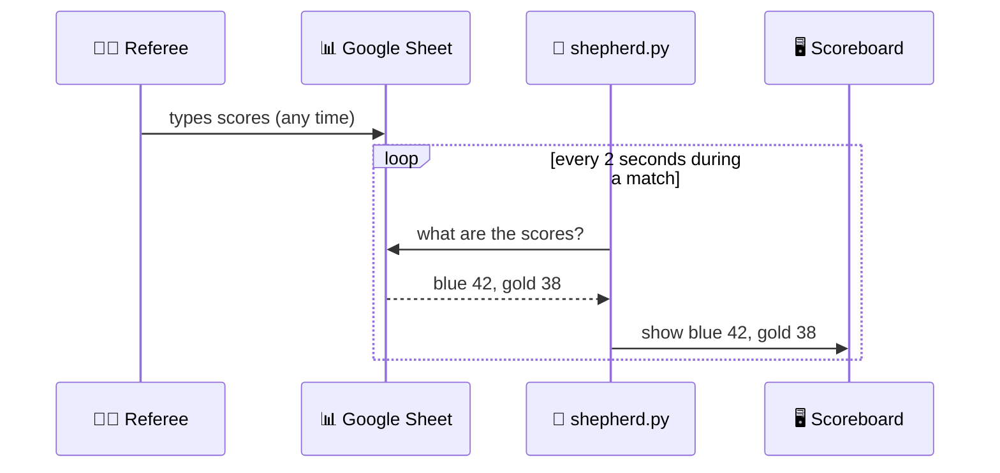

# Shepherd, Explained Simply

*A plain-language companion to [ARCHITECTURE.md](ARCHITECTURE.md). Same system,
fewer technical terms, more analogies.*

Shepherd is the software that **runs a robotics competition match**, the way a
referee crew runs a basketball game: it keeps the clock, keeps the score,
tells players when they can and can't play, and updates the big screen for the
crowd.

---

## The big idea: a group chat, not one big program

Shepherd is **not one program**. It's about six small programs running at the
same time, and they coordinate through something called **YDL**, which you can
think of as a **group chat with channels**.

- Each program subscribes to a channel (its "inbox"): `SHEPHERD`, `UI`,
  `SENSORS`, or `LIVE`.
- Any program can post a message to any channel.
- A message is like a text with a subject line: *who it's for*, *what it's
  about* (the "header"), and *the details* (the data).
- More than one program can follow the same channel — like a group chat,
  everyone following it sees every message and just ignores the ones that
  aren't for them.

Why build it this way? Because the pieces are physically different things: a
web page in a browser, an Arduino wired to buttons, robots on WiFi, a Google
Sheet. A shared "group chat" lets them all cooperate without knowing each
other's details.

---

## The dictionary everyone shares: `utils.py`

If YDL is the group chat, **`utils.py` is the shared dictionary of every
message you're allowed to send** — every subject line, spelled out once, and
imported by every program.

Messages are grouped by *who receives them*:

- `SHEPHERD_HEADER` — messages **to the head referee** ("a button was
  pressed", "start the next stage", "here are the teams").
- `UI_HEADER` — messages **to the screens** ("show these scores", "play the
  end sound").
- `SENSOR_HEADER` — messages **to the field hardware** ("turn on light 3",
  "lower the blue sail").
- `LIVE_HEADER` — messages **to the coding-challenge laptops**.

Rule of thumb when reading the code: *if you want to know how anything
communicates with anything, look it up in utils.py first.*

---

## The head referee: `shepherd.py`

`shepherd.py` is the brain. It runs one simple loop forever:

> **Wait for the next message → look at the current stage of the match →
> react appropriately → repeat.**

That's it. Everything else is details of "react appropriately."

The "current stage of the match" part matters because the same message can
mean different things at different times — like how a whistle means "start
playing" before the game but "stop playing" during it. Shepherd keeps a list
of allowed reactions *per stage*, so a "start" button press during a running
match simply does nothing.

### The stages of a match

A match walks through four stages, like periods in a game:

Two neat tricks worth pointing out:

- **The clock doesn't flip the stage directly.** When the timer runs out, it
  drops a "time's up!" message into shepherd's own inbox, and shepherd handles
  it like any other message. One thread, one queue, no race conditions — like
  a chef who only ever works from the order ticket rail, even for their own
  reminders.
- **Pausing really pauses everything.** All timers live in one group. Pausing
  freezes them mid-countdown (and disables the robots); resuming picks up at
  the exact second it left off — a stopwatch, not an egg timer.

---

## The mail room for browsers: `server.py`

Browsers can't join the YDL group chat directly, so `server.py` is the
**translator standing in the doorway**. It does exactly two things:

1. **Serves the web pages** — the public scoreboard, plus password-protected
   staff pages (the password check is like a stamp on your hand at an event:
   your browser keeps a cookie, and staff-only pages check for it).
2. **Relays messages both ways, word for word:**
   - Browser clicks a button → the page sends it to `server.py` → it posts it
     to shepherd's channel.
   - Shepherd posts something to the `UI` channel → `server.py` shouts it to
     **every open browser page** — a PA announcement, not a phone call. Each
     page just ignores announcements that aren't about it.

It keeps no game state at all. If it crashed and restarted mid-match, nothing
about the match would be lost.

One nice detail: **the scoreboard's ticking clock runs inside the browser.**
Shepherd says "this stage started at time X and lasts 270 seconds" *once*,
and the page does its own counting — the way you'd set your own watch after
hearing the start time, instead of asking the referee every second.

---

## The robots: `runtimeclient.py`

Shepherd holds **four direct phone lines**, one to each robot (they run
software called "Runtime" on a Raspberry Pi). These are *not* on the group
chat — they're private TCP connections.

Over these lines shepherd mostly says one word: the robot's **mode**.

- `IDLE` — "sit still" (before the match, after it, and during pauses)
- `AUTO` — "drive yourself" (autonomous period)
- `TELEOP` — "your human may drive" (driver period)

The robots talk back with a heartbeat — battery level, connection health —
which shepherd forwards to the staff screens. If a line drops, it redials
every second until it gets through. For practice at home there's
`fake_runtime.py`, an answering machine that pretends to be a robot.

---

## Hands on the field: `sensors.py` + `sensors_config.py`

The field has physical **lighted buttons** and **sails**, wired to Arduinos,
plugged into the computer by USB.

- `sensors.py` is the **generic machinery** — how to talk to any Arduino.
  Instead of the Arduino calling out when something happens, the computer
  runs a fast **roll call** about 100 times a second: "here's what your
  lights should show — now tell me every button's state." Simple and
  impossible to miss.
- It also **debounces**: a physical button press is electrically noisy, like
  a flickering light switch. The code waits until it sees the same reading
  almost 8 times in a row before believing it. One glitchy reading never
  counts as a press.
- `sensors_config.py` is **this year's wiring list** — which pin on which
  Arduino is which button, light, or sail. When a real press is confirmed, it
  posts "button 3 was pressed!" to the group chat.
- No hardware handy? `fake_sensors.py` draws the lights as `@` and `-` in
  the terminal and lets you "press" buttons by typing numbers.

> ⚠️ **Heads-up:** `sensors_config.py` currently has a typo — a list missing
> its commas (the `walls` list, around line 63) — so the file won't start
> until that's fixed.

---

## This year's games (rebuilt every season)

### Whack-a-mole: `whack_a_mole.py`

The rules-keeper for the button minigame. It watches the group chat for
"button pressed" messages and runs the game: light a button, wait for the
right press, and on success **flash all the lights and lower the alliance's
sail** — the field physically celebrating — then report the points.

It runs each alliance's game on its own worker thread, with a **sorter at the
door**: one thread reads the shared inbox and drops blue-side presses in the
blue bin and gold-side presses in the gold bin, so each game can wait on its
own bin without stealing the other's mail.

### Live coding: `live_coding.py`

During the match, students also solve programming challenges at station
laptops for points. `live_coding.py` is a **librarian with one job**: when
shepherd asks, it reads the challenge bank off disk, hands the whole thing
over, and clocks out. Shepherd then deals each station a shuffled deck of
challenges at the start of every match.

---

## The record book: `sheet.py` and Google Sheets

Surprise: **shepherd doesn't compute the final score.** Human referees type
scores into a shared **Google Sheet**, and that spreadsheet is the official
record book. Two tabs matter: the **match schedule** (which teams play in
match 12, and their robots' addresses) and the **ref scoresheet**.

Shepherd's relationship to it:

- Loading a match = looking up its row in the schedule tab (with a saved CSV
  copy as backup if the internet is down).
- During a match, a background helper **peeks at the ref tab every 2
  seconds** and posts what it finds, which flows to the scoreboard. That
  polling loop is the entire path from a referee's keyboard to the big
  screen:

Because talking to Google takes a few seconds, every spreadsheet call runs on
a **side thread** — an assistant sent to fetch the file so the head referee
never stops watching the game. Answers come back as messages in the chat, not
as return values.

---

## One match, start to finish

1. **Staff loads match 12** on the staff page → shepherd looks up the teams,
   writes the match row to the record book, and dials all four robots.
   Stage: **SETUP**.
2. **Staff hits start** → a cannon sound plays, a 20-second clock starts, and
   shepherd tells every robot "drive yourself." Stage: **AUTO**.
3. **Clock expires** → "time's up" lands in shepherd's inbox → a 4.5-minute
   clock starts and robots switch to "humans may drive." Stage: **TELEOP**.
   Meanwhile: refs type scores into the sheet, kids whack buttons, stations
   solve coding challenges — all flowing through the group chat.
4. **Clock expires again** → end sound, robots ordered to sit still and hung
   up on, lights off. Stage: **END**. The record book already has the scores.
5. Load the next match; back to step 1.

---

## Cheat sheet: who is who

| Program | One-line job | Analogy |
|---|---|---|
| `shepherd.py` | Runs the match, reacts to every event | 🧠 Head referee |
| `utils.py` | Defines every message anyone can send | 📖 Shared dictionary |
| `server.py` | Connects browsers to the group chat | 📮 Mail room / translator |
| `timer.py` | Pausable match clocks | ⏱️ Stopwatch |
| `runtimeclient.py` | Phone lines to the 4 robots | ☎️ Direct lines |
| `sheet.py` | Reads/writes the Google Sheet | 📊 Record book clerk |
| `sensors.py` / `sensors_config.py` | Talks to buttons, lights, sails | 🔌 Hands on the field |
| `whack_a_mole.py` | Runs the button minigame | 🎮 Minigame referee |
| `live_coding.py` | Loads the coding challenges | 📚 Librarian |
| `fake_runtime.py` / `fake_sensors.py` | Pretend robot / pretend field | 🎭 Stunt doubles for practice |

**To try it without any hardware:** open four terminals in `src/` and run
`python3 -m ydl`, `python3 server.py`, `python3 shepherd.py`, and
`python3 fake_sensors.py` — then visit `http://localhost:5002/scoreboard.html`.
