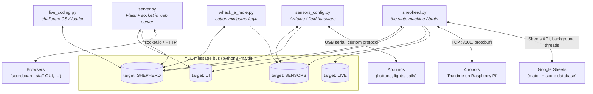
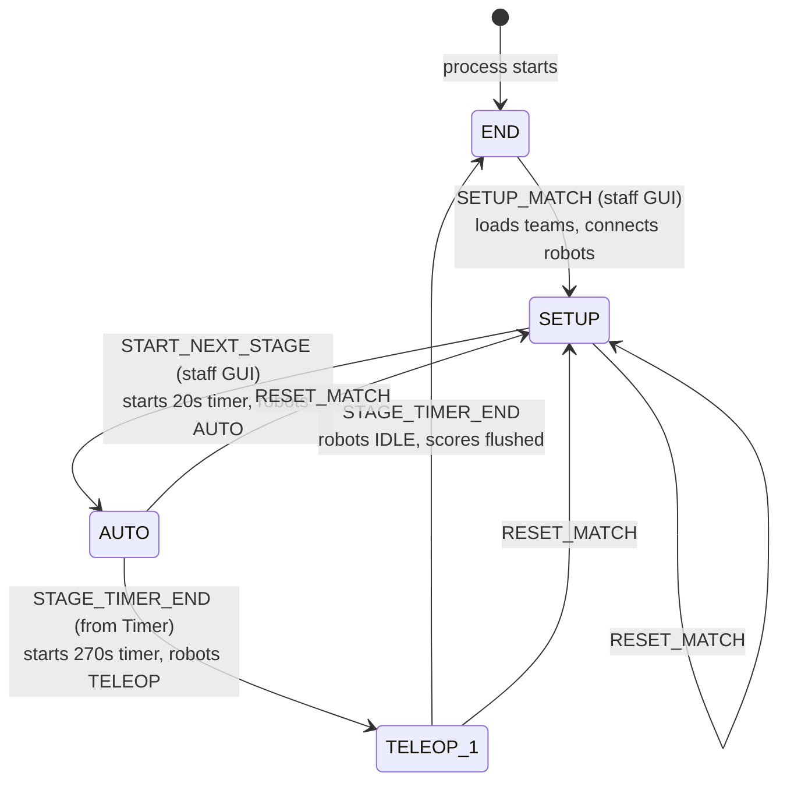
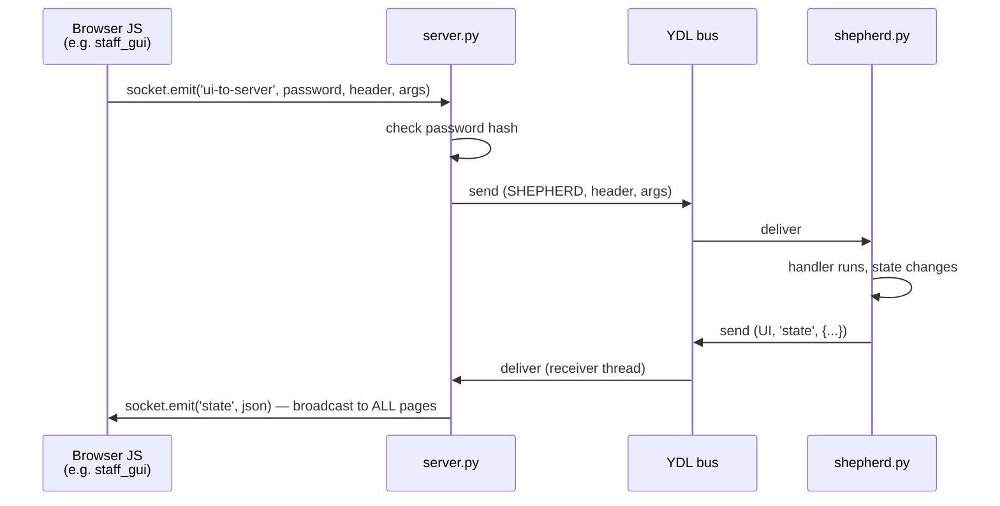
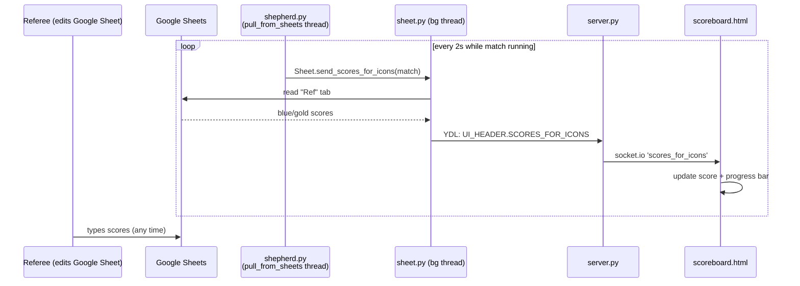
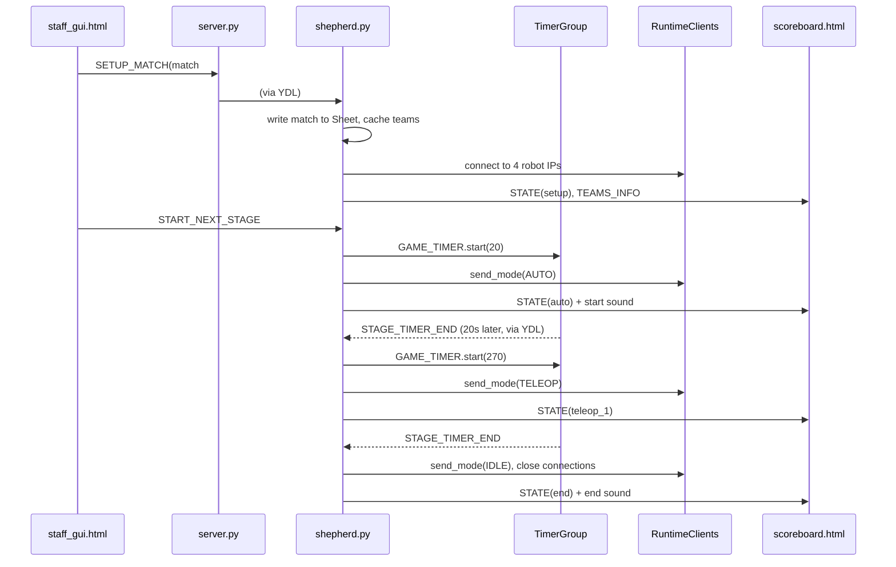

# Shepherd Architecture Overview

Shepherd is PiE's **field control system**: the software that runs a robotics
competition match. It keeps the official match clock, tracks scores, enables and
disables robots, reacts to physical buttons on the field, and drives the
scoreboard that the audience sees.

The single most important idea in this codebase: **Shepherd is not one program —
it's a small fleet of independent Python processes that talk to each other over
a message bus called YDL.** Almost every question of "how does X reach Y?" is
answered by "a YDL message defined in `src/utils.py`."

---

## 1. The processes (bird's-eye view)

Each box below is a separate OS process. `shepherd_tmux.sh` starts all six
panes for a full game.

Key facts about the bus:

- **YDL** is a pub/sub broker (external PiE library, run as `python3 -m ydl`).
  A process makes a `Client(<target>)` to *subscribe* to that target's mailbox,
  and can `send()` a message to any target.
- A message is a tuple `(target, header_name, args_dict)`.
- **Multiple processes can subscribe to the same target.** `shepherd.py`,
  `whack_a_mole.py`, and `live_coding.py` all listen on `SHEPHERD` — each gets
  a copy of every message and simply ignores headers it doesn't care about.

---

## 2. The protocol: `utils.py`

`src/utils.py` is imported by every process and is effectively the system's
protocol definition. Every message type is a "header" grouped by *recipient*:

| Class | Messages addressed to | Typical senders |
|---|---|---|
| `SHEPHERD_HEADER` | `shepherd.py` (and co-listeners) | UI, sensors, Sheet threads, timer callback |
| `UI_HEADER` | browsers, via `server.py` | shepherd, Sheet, runtimeclient |
| `LIVE_HEADER` | live-coding challenge stations | shepherd |
| `SENSOR_HEADER` | `sensors_config.py` | shepherd, whack_a_mole |

Calling a header, e.g. `SHEPHERD_HEADER.SET_STATE(state="auto")`, just builds
the message tuple; `YC.send(...)` puts it on the bus. The docstring on each
header documents who sends it — those docstrings *are* the protocol docs.

`utils.py` also defines the shared enums (`STATE`, `ALLIANCE_COLOR`,
`INDICES`), stage durations (`STAGE_TIMES`), the page list for the web server
(`UI_PAGES`), and the per-state handler registries (`SHEPHERD_HANDLER`).

---

## 3. The brain: `shepherd.py`

`shepherd.py` is an **event loop plus a state machine**. Its `start()` loop
blocks on `YC.receive()` and dispatches each message twice:

1. to `SHEPHERD_HANDLER.EVERYWHERE` (state-independent handlers), then
2. to the handler group for the current `GAME_STATE`.

Handlers are registered by decorator, so "what can happen in state X" is
greppable: `@SHEPHERD_HANDLER.SETUP.on(SHEPHERD_HEADER.SETUP_MATCH)` means
*"SETUP_MATCH is only acted on while in SETUP (or END, via the second
decorator)"*.

### Match state machine

Notes worth calling out when explaining:

- **Stage transitions are themselves events.** The `GAME_TIMER` callback
  doesn't call `to_teleop()` directly — it sends `STAGE_TIMER_END` back
  through YDL, so *every* state change happens on the main loop thread.
  Because the handler for `STAGE_TIMER_END` differs by state (AUTO→teleop,
  TELEOP_1→end), the same message means "advance to whatever is next."
- **Pause/resume** works via `TimerGroup` (`timer.py`): pausing converts each
  running timer's absolute end time into remaining seconds and disables the
  robots; resuming converts back and re-enables them.
- Globals hold all match state: `GAME_STATE`, `MATCH_NUMBER`, `ALLIANCES`
  (2 × `Alliance`, each with 2 × `Robot`), `CLIENTS` (4 robot connections).

---

## 4. The web layer: `server.py` + `templates/` + `static/`

`server.py` is a deliberately **stateless relay** between browsers and YDL:

- Flask serves the pages listed in `UI_PAGES` (in `utils.py`); pages marked
  `True` require a shared password, checked as
  `sha256(password + "cheese") == CONSTANTS.UI_PASSWORD_HASH` against a cookie.
- Every YDL message to the `UI` target is **broadcast to every connected
  browser**; each page's JS subscribes only to the socket.io events (= header
  names) it cares about.
- Pages (in `templates/`, logic in `static/*.js`): `scoreboard.html` (public
  audience view — clock, scores, teams), `staff_gui.html` (match control),
  `match_creator.html`, `match_recovery.html`, `score_adjustment.html`,
  `alliance_selection.html`, `bracket_ui.html`, `whackamole.html`.
- **The scoreboard clock runs client-side**: shepherd sends the stage's start
  time and duration once; `scoreboard.js` re-renders the countdown every
  200 ms from local wall-clock math. Pause/resume messages stop/restart it.

---

## 5. The robots: `runtimeclient.py` + `protos/`

Each robot runs "Runtime" on a Raspberry Pi listening on TCP port 8101.
`shepherd.py` holds a `RuntimeClientManager` with one `RuntimeClient` per
robot (indices `INDICES.BLUE_1=0 … GOLD_2=3`).

- **Wire format**: `[1-byte msg type][2-byte little-endian length][protobuf]`,
  message types in `PROTOBUF_TYPES`, generated protobuf classes in
  `src/protos/`.
- **Shepherd → robot**: run mode (`IDLE`/`AUTO`/`TELEOP`) on stage changes and
  when a ref toggles a robot; also start position and game state.
- **Robot → Shepherd**: `RuntimeStatus` (battery, connections, version),
  forwarded straight to the staff UI as `UI_HEADER.RUNTIME_STATUS`.
- Each client has a background thread that receives and **auto-reconnects
  every second** until deliberately closed.
- `fake_runtime.py` fakes a robot on `127.0.0.1:8101` for development.

---

## 6. The field hardware: `sensors.py` + `sensors_config.py` + `sensors/sensors.ino`

The field has physical lighted buttons and sail mechanisms driven by Arduinos
over USB serial (Linux only, `termios`-based).

- `sensors.py` — *generic machinery* (documented in detail in its module
  docstring): serial port setup, a magic-number/UUID handshake, then a fixed
  request–response **polling loop** (every ~10 ms all output pin states are
  sent, all input pin states received). `InputPin` debounces by requiring a
  new value to fill nearly all of an 8-reading window before firing its
  callback.
- `sensors_config.py` — the *year-specific wiring*: which pins are buttons
  (ids 0–4 blue, 5–9 gold), button lights, and sails, on which Arduino UUIDs.
  Button presses become `SHEPHERD_HEADER.BUTTON_PRESS`; incoming
  `SENSOR_HEADER` messages (light on/off, raise/lower sail) set output pins.
- `sensors/sensors.ino` — the Arduino side of the same protocol; set a unique
  `MY_UUID` per board before flashing.
- `fake_sensors.py` — terminal simulator: type `0`–`9` to "press" buttons,
  lights render as `@`/`-`.

> ⚠️ **Known issue** (as of this doc): `sensors_config.py` has a syntax error —
> the `walls` list (~line 63) is missing commas between its `OutputPin`
> entries, so the file currently fails to import. Add the commas to run it.

---

## 7. Game-specific logic (rewritten each season)

### `whack_a_mole.py` — field button minigame

A standalone process co-listening on the `SHEPHERD` target. Its main thread
(`fill_queue`) routes `BUTTON_PRESS` and match-lifecycle events into a blue
queue and a gold queue; four daemon threads (a whack-a-mole loop and a sail
task per alliance) consume them. Completing a sequence triggers
`celebrate()`: flash all lights, lower the alliance's sail
(`SENSOR_HEADER.LOWER_SAIL`), and report the score to shepherd
(`SEND_SAIL_STATUS` → Google Sheet).

### `live_coding.py` + `live/q.csv` — live coding challenges

Teams solve coding challenges mid-match at station laptops ("bleatcode" UIs,
the `LIVE` YDL target). `live_coding.py` parses the pipe-delimited challenge
bank once, on shepherd's `PARSE_LIVE_FILE` request, and replies with
`SEND_LIVE_FILE_TO_SHEPHERD`. During match setup shepherd deals each station a
random challenge ordering via `LIVE_HEADER.SET_CHALLENGE` /
`SET_LIVE_CHALLENGES`. Station scores flow back as `SEND_CHALLENGES_SCORE` and
get written to the sheet.

---

## 8. Scores & persistence: `sheet.py`

The **Google Sheet is the source of truth** for the match schedule and scores;
shepherd's in-memory scores are secondary. Two tabs matter:

- **Match Database** — one row per match: match #, then team #/name/robot IP
  for all four robots. Read by `get_match`, written by `write_match_info`.
  Falls back to a local CSV in `sheets/` when offline.
- **Ref** — two rows per match (Blue, then Gold) where human referees enter
  scores. Shepherd never computes the final score; it *polls* this tab.

Everything runs on background threads (a Sheets round-trip takes seconds and
the event loop must never block) and results come back as YDL messages, never
return values.

The score display loop, end to end:

Auth: OAuth via `sheets/client_secret.json` on first run; token cached in
`sheets/user_token.json` (gitignored).

---

## 9. A complete match, end to end

---

## 10. File map

| Path | Role |
|---|---|
| `src/shepherd.py` | Central event loop + match state machine |
| `src/utils.py` | **Protocol**: YDL targets, all message headers, enums, constants |
| `src/server.py` | Flask/socket.io bridge between browsers and YDL |
| `src/timer.py` | Pausable timers (`TimerGroup`/`Timer`) for the match clock |
| `src/runtimeclient.py` | TCP + protobuf links to the 4 robots |
| `src/protos/` | Generated protobuf messages shared with Runtime |
| `src/sheet.py` | Google Sheets reads/writes (all on background threads) |
| `src/robot.py`, `src/alliance.py` | Plain data holders for teams and sides |
| `src/sensors.py` | Generic Arduino serial protocol + pin abstraction |
| `src/sensors_config.py` | Year-specific pin wiring + SENSOR_HEADER handlers (⚠ syntax error, see §6) |
| `src/sensors/sensors.ino` | Arduino firmware half of the sensor protocol |
| `src/whack_a_mole.py` | Button minigame process |
| `src/live_coding.py`, `src/live/` | Live-coding challenge loader + data |
| `src/templates/`, `src/static/` | UI pages and their JS/CSS/assets |
| `src/fake_runtime.py`, `src/fake_sensors.py` | Hardware-free dev stand-ins |
| `shepherd_tmux.sh` | Launches all six processes in one tmux session |
| `src/hardware_test.py`, `src/test_*.py`, `src/quick_test.py` | Hardware/bench test scripts |

## 11. Running it

Minimal (no hardware): four terminals in `src/` —
`python3 -m ydl`, then `python3 server.py`, `python3 shepherd.py`, and
optionally `python3 fake_sensors.py` / `python3 fake_runtime.py`.
Browse to `http://localhost:5002/scoreboard.html` (public) or
`staff_gui.html` (password-protected). Full game: `./shepherd_tmux.sh`.
