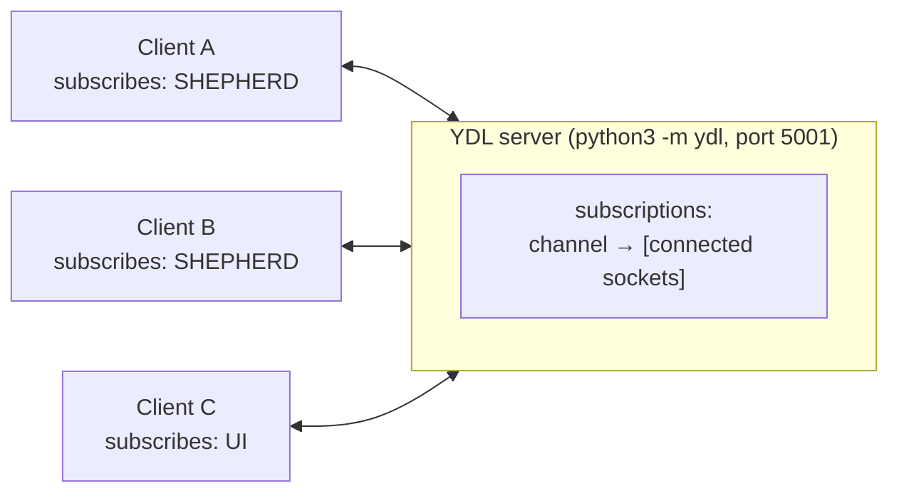
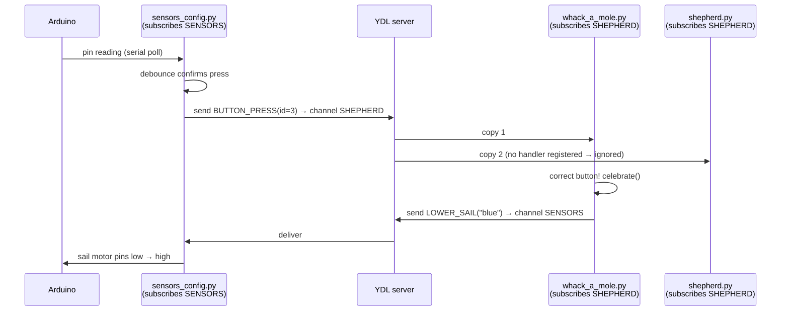

# How YDL Works

YDL is the message bus that connects every Shepherd process. It's a small
pub/sub library maintained by PiE ([github.com/pioneers/ydl](https://github.com/pioneers/ydl),
installed as `ydl-ipc`) — the whole thing is about 300 lines of Python.
This doc explains the library itself, then walks through how this codebase
uses it, with real examples you can trace.

---

## 1. The mental model



- The **server** (`python3 -m ydl`) is a dumb relay. It keeps one table:
  channel name → list of subscribed sockets. When a message arrives for a
  channel, it forwards a copy to **every** subscriber of that channel. It
  never inspects message contents.
- A **Client** subscribes to zero or more channels at construction time and
  can **send to any channel**, including ones it doesn't listen to.
- A **channel** is just a string. In Shepherd the strings live in
  `YDL_TARGETS` ([utils.py](src/utils.py)): `"ydl_target_shepherd"`,
  `"ydl_target_ui"`, `"ydl_target_sensors"`, `"ydl_target_challenges"`.
- **Multiple subscribers per channel is normal.** `shepherd.py`,
  `whack_a_mole.py`, and `live_coding.py` all subscribe to the SHEPHERD
  channel; each receives its own copy of every message and ignores what it
  doesn't handle.
- If nobody subscribes to a channel, messages to it are **silently dropped**
  (e.g. `SENSOR_HEADER` messages when `sensors_config.py` isn't running —
  the rest of the system doesn't notice or care).

Under the hood it's plain TCP with a tiny length-prefixed frame carrying two
strings: the channel name and a JSON-encoded payload. Clients auto-reconnect
forever, which is why you can start/restart the processes in any order —
they'll block until the server is up.

---

## 2. The three building blocks

YDL exports exactly three things this codebase uses: `Client`, `header`, and
`Handler`.

### 2.1 `Client` — send and receive tuples

```python
from ydl import Client

yc = Client("ydl_target_shepherd")   # subscribe to a channel (can pass several, or none)

yc.send(("ydl_target_ui", "scores", {"blue_score": 10, "gold_score": 20}))

msg = yc.receive()   # blocks until a message arrives on a subscribed channel
# msg == ("ydl_target_shepherd", "button_press", {"id": 3})
```

A message on the wire is `(channel, *stuff)` where `stuff` is anything
JSON-serializable. By Shepherd's convention, `stuff` is always
`(header_name, args_dict)`, so every received message is the 3-tuple:

```
(target_channel, header_name, args_dict)
```

`receive()` blocks, so every process that listens has a dedicated receive
loop — either its main thread ([shepherd.py](src/shepherd.py),
[sensors_config.py](src/sensors_config.py)) or a background thread
([server.py](src/server.py)'s `receiver()`).

### 2.2 `header` — functions that build messages

Nobody hand-writes those tuples. Every message type is declared once in
[utils.py](src/utils.py) using the `@header` decorator:

```python
# utils.py
class SHEPHERD_HEADER():
    @staticmethod
    @header(YDL_TARGETS.SHEPHERD, "button_press")   # (channel, header_name)
    def BUTTON_PRESS(id):
        """
        source: sensors. Notifies that a button has been pressed
        """
```

The decorator turns `BUTTON_PRESS` into a function that **returns the message
tuple** instead of doing anything itself:

```python
SHEPHERD_HEADER.BUTTON_PRESS(id=3)
# returns: ("ydl_target_shepherd", "button_press", {"id": 3})
```

The function body is empty on purpose — the parameter list `(id)` is the
schema (the decorator reads it via `inspect` to build the args dict, filling
in any defaults), and the docstring is the documentation. Sending is always
the combination:

```python
YC.send(SHEPHERD_HEADER.BUTTON_PRESS(id=3))
```

So `utils.py` is a *typed catalog of every message in the system*: the class
tells you the recipient, the decorator ties name to channel, the signature
tells you the required fields.

### 2.3 `Handler` — dispatch received messages to functions

`Handler` is the receiving-side registry: a dict from header name → function.

```python
yh = Handler()

@yh.on(SENSOR_HEADER.TURN_ON_BUTTON_LIGHT)
def turn_on_button_light(id):        # params MUST match the header's params
    lights[id].set_state(high)

msg = yc.receive()
yh.handle(msg)   # if msg is ("...", "turn_on_button_light", {"id": 2}),
                 # calls turn_on_button_light(id=2); otherwise does nothing
```

Two rules the library enforces with assertions at import time:

- A handler's parameter names must **exactly match** the header's parameter
  names (it calls your function as `fn(**args_dict)`).
- One `Handler` can hold at most **one function per header** (but the same
  function can be registered in *several* Handlers — that's the trick
  shepherd.py's state machine is built on).

`handle()` returns a truthy tuple if it dispatched and `()` if it didn't, and
silently ignores unknown headers — which is what lets multiple processes
share a channel safely.

---

## 3. How Shepherd uses these pieces

### 3.1 The state machine: one Handler per game state

[shepherd.py](src/shepherd.py) doesn't use one `Handler` — it uses five
(defined in utils.py): `EVERYWHERE`, `SETUP`, `AUTO`, `TELEOP_1`, `END`.
Registering a function under a state's Handler *is* the declaration
"this event is legal in this state":

```python
# shepherd.py — SETUP_MATCH is only acted on in SETUP or END:
@SHEPHERD_HANDLER.SETUP.on(SHEPHERD_HEADER.SETUP_MATCH)
@SHEPHERD_HANDLER.END.on(SHEPHERD_HEADER.SETUP_MATCH)
def to_setup(match_num, teams):
    ...

# PAUSE_TIMER works in any state:
@SHEPHERD_HANDLER.EVERYWHERE.on(SHEPHERD_HEADER.PAUSE_TIMER)
def pause_timer():
    ...
```

The event loop then dispatches each message twice — to EVERYWHERE, then to
whichever Handler matches the current state:

```python
# shepherd.py
while True:
    payload = YC.receive()
    SHEPHERD_HANDLER.EVERYWHERE.handle(payload)
    if GAME_STATE in STATE_HANDLERS:
        STATE_HANDLERS.get(GAME_STATE).handle(payload)
```

Same message, different meaning per state: `STAGE_TIMER_END` is handled by
`to_teleop` when registered under `AUTO`, and by `to_end` under `TELEOP_1`.
A press of "start" during a running match dispatches to nothing and is
simply ignored.

### 3.2 Even Shepherd's own timer talks to it via YDL

When the stage clock expires, the callback doesn't call the transition
function — it *sends Shepherd a message*, so the transition runs on the main
event-loop thread like everything else:

```python
# shepherd.py
GAME_TIMER = Timer(TIMERS,
                   lambda: YC.send(SHEPHERD_HEADER.STAGE_TIMER_END()))
```

[sheet.py](src/sheet.py) does the same from its background threads: results
of slow Google Sheets calls come back as messages
(`SHEPHERD_HEADER.SET_TEAMS_INFO`), never as return values.

### 3.3 The browser bridge: header names become socket.io events

[server.py](src/server.py) converts between the two worlds mechanically:

```python
# browser -> YDL: page JS emits ('ui-to-server', password, header_name, json)
@socketio.on('ui-to-server')
def ui_to_server(p, header, args=None):
    if not password(p):
        return
    YC.send((YDL_TARGETS.SHEPHERD, header, json.loads(args)))

# YDL -> browser: every UI-channel message is rebroadcast to all pages,
# with the header name as the socket.io event name
def receiver():
    while True:
        event = tpool.spawn(YC.receive).get()      # (target, header, args)
        socketio.emit(event[1], json.dumps(event[2]))
```

So `UI_HEADER.SCORES(...)` sent anywhere in Python arrives in the browser as
a `'scores'` socket.io event — the header names in utils.py and the
`socket.on(...)` names in [static/scoreboard.js](src/static/scoreboard.js)
are the same strings by construction.

### 3.4 Raw handling (no Handler) is fine too

A Handler is optional sugar. [whack_a_mole.py](src/whack_a_mole.py) and
[live_coding.py](src/live_coding.py) just pattern-match on the tuple:

```python
# whack_a_mole.py — routing shared-channel messages into per-alliance queues
msg = YC.receive()
if msg[1] == 'button_press':
    if msg[2]['id'] < NUM_BUTTONS:
        BLUE_QUEUE.put(msg)
    else:
        GOLD_QUEUE.put(msg)
```

### 3.5 Summary: one send pattern, three receive patterns

**Sending is uniform across the whole repo.** Every send is
`YC.send(<HEADER>.NAME(args))` — the header call builds the tuple, `send`
ships it. The only two exceptions are hand-built raw tuples:
[server.py](src/server.py)'s `ui_to_server` (it forwards a header name the
browser gave it, so there's no header function to call) and
[sheet.py](src/sheet.py)'s `("ydl_target_shepherd", 16383)` nudge (§5).

**Receiving comes in three flavors:**

| Pattern | Who uses it | How dispatch happens |
|---|---|---|
| `Handler` + `handle()` | [sensors_config.py](src/sensors_config.py), [fake_sensors.py](src/fake_sensors.py) (one Handler); [shepherd.py](src/shepherd.py) (five Handlers, per game state) | `yh.handle(msg)` looks up the header name in the registry and calls the registered function |
| Raw tuple inspection | [whack_a_mole.py](src/whack_a_mole.py), [live_coding.py](src/live_coding.py) | Manual `if msg[1] == "...":` checks — same loop, no registry |
| Blind relay | [server.py](src/server.py) | Never looks at the header; forwards **every** UI-channel message to all browsers, where the page JS's `socket.on('scores', ...)` handlers play the role of `@yh.on` |

Two things intentionally outside this picture: the `LIVE` channel's receiver
(the bleatcode challenge-station app) lives in a separate repo, and
[runtimeclient.py](src/runtimeclient.py)/[fake_runtime.py](src/fake_runtime.py)
don't use YDL at all — robot communication is direct TCP with protobufs.

---

## 4. A message traced end to end

What happens when a field button is pressed, across three processes and two
channels:



In code, hop by hop:

```python
# 1. sensors_config.py — the debounced press handler fires:
YC.send(SHEPHERD_HEADER.BUTTON_PRESS(id=id))
#    the tuple ("ydl_target_shepherd", "button_press", {"id": 3})
#    goes to the YDL server, which copies it to BOTH subscribers.

# 2. shepherd.py receives it; no handler registered for "button_press"
#    in any of its Handlers → handle() returns () → ignored.

# 3. whack_a_mole.py receives its copy, matches msg[1] == 'button_press',
#    queues it; the blue game thread pops it, sees it's correct, and:
YC.send(SENSOR_HEADER.LOWER_SAIL(alliance))     # → channel SENSORS
YC.send(SHEPHERD_HEADER.SEND_SAIL_STATUS(alliance))  # → channel SHEPHERD

# 4. sensors_config.py's loop receives LOWER_SAIL and its Handler runs:
@yh.on(SENSOR_HEADER.LOWER_SAIL)
def lower_sail(alliance): ...        # toggles the sail output pins

# 5. shepherd.py receives SEND_SAIL_STATUS (registered EVERYWHERE) and
#    writes the score to the Google Sheet:
@SHEPHERD_HANDLER.EVERYWHERE.on(SHEPHERD_HEADER.SEND_SAIL_STATUS)
def send_sail_status(alliance):
    Sheet.write_sail(MATCH_NUMBER, alliance)
```

---

## 5. Practical notes & gotchas

- **Start the server first** (`python3 -m ydl`). Clients block retrying every
  0.1 s until it's up, so other processes will appear to hang, not crash.
  For a networked field (`shepherd_tmux.sh`) it runs as
  `python3 -m ydl -a 0.0.0.0 -p 5001` so other machines can join.
- **Messages are fire-and-forget.** No acknowledgements, no replies, no
  persistence. "Request/response" is done with two one-way messages (e.g.
  `GET_STATE` in, `UI_HEADER.STATE` back out).
- **Args must be JSON-serializable** — everything crosses the wire as JSON.
- **Adding a new message** = add a header in the right `*_HEADER` class in
  utils.py (channel picks the recipient, signature defines the fields),
  then register a matching handler on the receiving side. The import-time
  assertion will catch a parameter-name mismatch immediately.
- **Duplicate registration** of a header in the *same* Handler raises
  `"duplicate header"` at import; registering the same function in
  *different* Handlers (multiple decorators) is the intended pattern.
- **Ordering** is preserved per sender-connection, but messages from
  different processes interleave arbitrarily.
- One curiosity you'll hit while reading [sheet.py](src/sheet.py):
  `YC.send(("ydl_target_shepherd", 16383))` — a hand-built 2-tuple with no
  args dict. Every `Handler.can_handle` check fails on it (wrong length), so
  it's effectively a no-op wake-up nudge to the shepherd channel.
